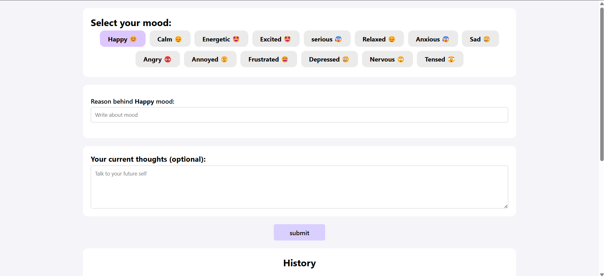
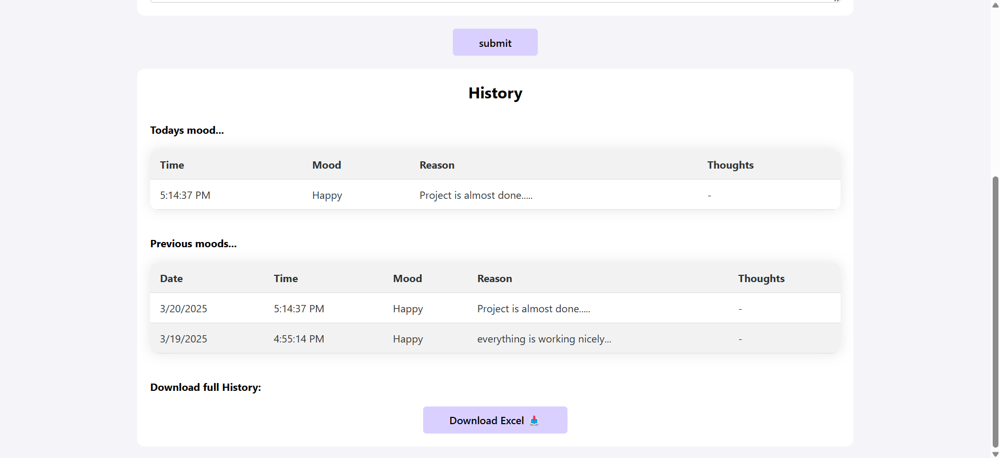

# Daily Mood Tracker

A simple and interactive web-based **Daily Mood Tracker** that allows users to log their moods, add reasons, and store history. The application provides a smooth and responsive user experience with **animations, local storage support**, and a **clean UI**.

Live at: https://daily-mood-tracker-masterji.netlify.app/

---

## 🛠️ Technologies


## 🚀 Features

✅ **Select Mood** – Choose your current mood from multiple options.  
✅ **Provide a Reason** – Enter a reason for your mood.  
✅ **Save Mood History** – Stores your mood data locally.  
✅ **View Past Entries** – Check today's and previous mood history.  
✅ **Export Mood History** – Download all stored moods as an **Excel file**.  
✅ **Clear History** – Erase all mood history.
✅ **Smooth Animations** – Subtle UI transitions for an engaging experience.  
✅ **Fully Responsive** – Optimized for mobile, tablet, and desktop users.

---

## 📂 Project Structure

```bash
📦 Daily Mood Tracker
 ┣ 📜 index.html       # Main HTML structure
 ┣ 📜 style.css        # Responsive styling & animations
 ┣ 📜 script.js        # Core functionality
 ┗ 📜 README.md        # Documentation
```

---

## 🎨 UI Preview





---

## 🛠️ Installation & Setup

1. **Clone the repository**:

   ```bash
      git clone https://github.com/Jasmin-Patel-2110/Daily-Mood-Tacker
   ```

2. **Navigate into the project**:

   ```sh
      cd Daily-Mood-Tacker
   ```

3. **Run the application**:  
   Simply open `index.html` in a browser. No additional setup is required!

---

## 🏗️ How It Works

1. Click on a **mood** to select it.
2. Enter a **reason** for your mood.
3. Click **Submit** to save your entry.
4. View your **mood history** for the day and past entries.
5. Click **Export to Excel** to download all stored mood history.
6. Click **Clear History** to erase all mood history.
7. The app uses **local storage** to keep your data safe.

---

## 👩‍💻 For Developers

- **Local Storage** is used to persist mood data without a database.
- **CSS Animations & Transitions** for a smooth UI experience.
- **JavaScript** manages mood selection, form handling, history retrieval, and Excel export.
- **Fully Responsive Design** ensures compatibility across all devices.
- **SheetJS (xlsx.js)** is used to export mood history to Excel.

---

## 🛠️ Technologies Used

- **HTML5** – Structure
- **CSS3** – Styling & Animations
- **JavaScript (Vanilla)** – Functionality
- **SheetJS (xlsx.js)** – Excel File Export

---

## 📝 Future Improvements

🔹 Add authentication & cloud storage support.  
🔹 Implement graphs to visualize mood trends.  
🔹 Export data in **CSV & PDF formats**.

---

## 💬 Feedback & Contributions

Found a bug? Have a feature request? Feel free to **open an issue** or contribute!  
Let's build something awesome together. 🚀
